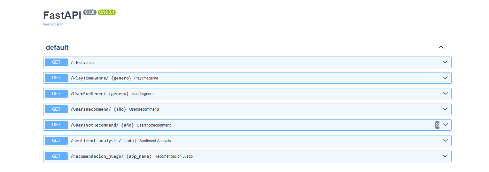
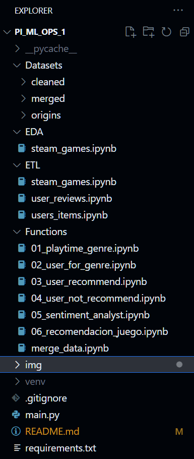

# Proyecto Individual Nº 1 Machine Learning

¡Bienvenido al proyecto de Machine Learning! Este proyecto tiene como objetivo explorar y analizar datos de Steam, la popular plataforma de juegos, para ofrecer a los usuarios una variedad de funciones útiles. A continuación, se describen las principales características del proyecto:

!

# Índice

1. [Proyecto Individual Nº 1 Machine Learning](#proyecto-individual-nº-1-machine-learning)
    - [Funcionalidades Principales](#funcionalidades-principales)
    - [Cómo Empezar](#cómo-empezar)
    - [Cómo Ejecutar Localmente](#cómo-ejecutar-localmente)
2. [ESTRUCTURA DEL PROYECTO](#estructura-del-proyecto)
    - [Datasets](#datasets)
    - [EDA](#eda)
    - [ETL](#etl)
    - [Functions](#functions)
    - [main](#main)
    - [requirements](#requirements)
3. [VIDEO](#video)
4. [CONTACTO](#contacto)
5. [TECNOLOGIAS APLICADAS](#tecnologias-aplicadas)

# CARACTERÍSTICAS:

    El proyecto aborda el análisis de datos de la plataforma Steam mediante técnicas de Machine Learning. Ofrece funcionalidades 
    como la identificación de patrones de juego a lo largo del tiempo, recomendaciones personalizadas y análisis de sentimientos 
    en reseñas de usuarios. La estructura del proyecto, implementado en FastAPI y desplegado en Render, facilita su ejecución y 
    exploración. Con una variedad de tecnologías aplicadas y una invitación a la colaboración, el proyecto demuestra una 
    combinación efectiva de habilidades en ciencia de datos y machine learning.

Estas son sus funcionalidades:

- <u>Año con Mayor Tiempo Jugado por Género</u>:  
    Descubre cuál fue el año con mayor tiempo jugado para un género específico. Obtén información valiosa sobre las preferencias de los jugadores a lo largo del tiempo.

- <u>Usuario con Mayor Tiempo de Juego por Año de Lanzamiento y Género</u>:  
    Encuentra al usuario que ha invertido más tiempo en juegos lanzados en un año determinado y pertenecientes a un género específico. Explora las tendencias de juego de los usuarios más dedicados.

- <u>Recomendación de Juegos Positiva y Negativa</u>:  
    Obtén recomendaciones personalizadas de juegos, tanto positivas como negativas, basadas en patrones de juego y preferencias previas.

- <u>Análisis de Sentimientos en Reviews de Usuarios</u>:  
    Explora el análisis de sentimientos de las reseñas de los usuarios para comprender cómo se sienten acerca de los juegos. Descubre insights valiosos sobre la satisfacción del usuario.

- <u>Recomendación de Juegos con Modelo de Machine Learning (ML) Entrenado</u>:  
    Experimenta con recomendaciones avanzadas utilizando un modelo de ML entrenado. Descubre juegos que podrían ajustarse perfectamente a tus preferencias de juego.

# Cómo Empezar
    Dentro del entorno de FastAPI, encontrarás endpoints listos para interactuar con ellos. Este entorno está
     implementado y desplegado en Render, lo que garantiza una    experiencia de desarrollo eficiente y 
     acceso fácil a las funcionalidades que ofrece. 

[Link a proyecto en Render](https://pi-ml-ops-u2y3.onrender.com/docs#/default/PlayTimeGenre_PlayTimeGenre___genero__get)

- Uso de Endpoints:  
    Utiliza los diversos endpoints proporcionados para acceder a la información específica que necesitas. Consulta la documentación detallada para obtener instrucciones sobre cada función.

    * <u>def PlayTimeGenre( genero : str )</u>: Debe devolver año con mas horas jugadas para dicho género.  
        

    * <u>def UserForGenre( genero : str )</u>: Debe devolver el usuario que acumula más horas jugadas para el género dado y una lista de la acumulación de horas jugadas por año  
        

    * <u>def UsersRecommend( año : int )</u>: Devuelve el top 3 de juegos MÁS recomendados por usuarios para el año dado. (reviews.recommend = True y comentarios positivos/neutrales) 
        

    * <u>def UsersNotRecommend( año : int )</u>: Devuelve el top 3 de juegos MENOS recomendados por usuarios para el año dado. (reviews.recommend = False y comentarios negativos) 
        

    * <u>def sentiment_analysis( año : int )</u>: Según el año de lanzamiento, se devuelve una lista con la cantidad de registros de reseñas de usuarios que se encuentren categorizados con un análisis de sentimiento. 
        
    
    * <u>def recomendacion_juego( id de producto )</u>: Ingresando el id de producto, deberíamos recibir una lista con 5 juegos recomendados similares al ingresado. 

- Exploración y Análisis:
    Experimenta con las funcionalidades del proyecto y descubre patrones interesantes en los datos de Steam.

- Colaboración y Mejoras:

¡Contribuye al proyecto! Si tienes ideas para nuevas funcionalidades o mejoras, no dudes en colaborar. 

!

# Cómo Ejecutar Localmente

Si deseas ejecutar este proyecto en tu máquina local, sigue estos pasos:

1. Clona este repositorio: `git clone URL_del_Repositorio`
2. Instala las dependencias: `pip install -r requirements.txt`
3. Ejecuta la aplicación: `uvicorn main:app --reload`
4. Después de haber ejecutado la aplicación localmente, puedes acceder a ella en tu navegador web. Abre tu navegador preferido y visita la siguiente dirección:

    [http://localhost:8000/docs](http://localhost:8000/docs)

        Esto abrirá la aplicación en tu máquina local. Asegúrate de que la aplicación esté en ejecución y 
        que el puerto 8000 no esté siendo utilizado por otra aplicación.

# ESTRUCTURA DEL PROYECTO

- Datasets: Incluye 3 carpetas (cleaned / merged/ origin), en la carpeta cleaned se encuentran los datos transormados y limpios, en la carpeta merged se encuentran todas las tablas y Joins que fui creando a lo largo del proyecto para asi correr las funciones, y en carpeta origin se encuentran los datos crudos como fueron servidos antes de iniciar el proyecyo.

- EDA: Se encuentra un analisis de los datos, buscamos metricas y relaciones entre las variables de los Datasets.

- ETL: Se encuentran 3 notebooks, uno por cada Datasets entregado para realizar el proyecto. En los mismos encontraras las transformaciones necesarias para poder realizar  el proyecto.

- Functions: En esta carpeta encontraras un notebook por cada endpoint solicitado, un notebook en donde se realizada el modelo completo y uno en donde creo tablas para poder correr esas funciones en render, con el fin de utulizar una cantidad minima de memoria, ya que render en su version gratuita solo te permite utilizar 500 mb.

- main: Este archivo implementa una API con FastAPI que proporciona consultas a una base de datos relacionada con la plataforma Steam.

- requirements: Contiene dependecias del proyecto, para poder hacer deploy en render.

# VIDEO 

[LINK PRESENTACION]()

# CONTACTO

Mariano Andrés Popov

- [Linkedin](https://www.linkedin.com/in/mariano-popov-3a4570290/)
- Correo: mariano.popov@gmail.com

# TECNOLOGIAS APLICADAS

Python | Pandas | Sckit-Learn | FastApi | Seaborn | Matplotlib